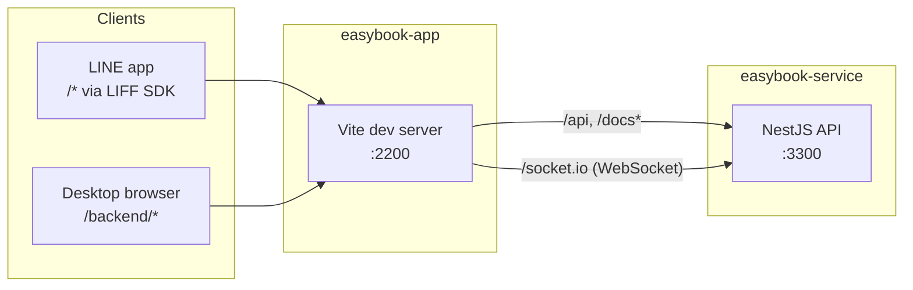
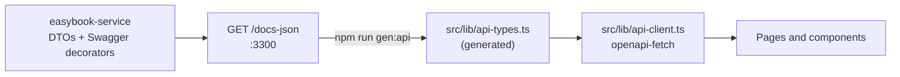

# EasyBook - Web Application

> Client-facing LINE LIFF web application and staff back-office for EasyBook, built as one React
> single-page application.

[](https://nodejs.org/)
[](https://react.dev/)
[](https://vite.dev/)
[](https://tailwindcss.com/)
[](https://daisyui.com/)
[](#system-context)

[System Context](#system-context) • [Quick Start](#quick-start) • [Environment Variables](#environment-variables) • [Scripts](#available-scripts) • [API Contract](#api-contract-synchronization) • [Research](#academic-context--research)

The application serves two surfaces: the LINE LIFF client used by end users inside the LINE app,
and the back-office used by staff in a desktop browser.

## System Context



| Item | Value |
|---|---|
| Dev server | `http://localhost:2200` (Vite) |
| Backend | `easybook-service` on `http://localhost:3300` |
| Client surface | `/*`, rendered inside LINE through the LIFF SDK |
| Back-office | `/backend/*`, cookie session issued by `easybook-service` |
| Realtime | Socket.IO client, `/socket.io/` on the backend origin |

> [!NOTE]
> Outside the LINE app, every path not claimed by `/backend/*` redirects to `/backend`. The client
> surface is reached through LINE or with a LIFF id configured.

In development the Vite server proxies backend paths, so the browser makes same-origin requests
and no CORS configuration is needed:

| Path | Target | Notes |
|---|---|---|
| `/api` | `http://localhost:3300` | REST, prefix `/api/v1` |
| `/docs`, `/docs-json`, `/docs-yaml` | `http://localhost:3300` | Swagger UI and the OpenAPI spec |
| `/socket.io` | `http://localhost:3300` | WebSocket upgrade enabled (`ws: true`) |

Production builds do not proxy. They call the origin in `VITE_API_URL` directly.

## Stack

| Concern | Package |
|---|---|
| UI | React 19, React Router 7 |
| Build | Vite 8, TypeScript 6 |
| Styling | Tailwind CSS 4 (`@tailwindcss/vite`, configured in `src/index.css`), daisyUI 5 |
| API client | `openapi-fetch` over types generated by `openapi-typescript` |
| LINE | `@line/liff` |
| Realtime | `socket.io-client` |
| Tests | Vitest 4, Testing Library, jsdom |
| Lint | oxlint |

## Prerequisites

- Node.js 20 (`.nvmrc`; `package.json` requires `>=20`)
- npm (`.npmrc` sets `legacy-peer-deps=true`)
- A running `easybook-service` on port 3300, or the bundled stub backend (see
  [Stub backend](#stub-backend))
- Optional: a LINE LIFF app id from the LINE Developers console, to exercise the client surface

## Quick Start

1. Install dependencies. The `prepare` script installs the husky Git hooks.

   ```bash
   npm install
   ```

2. Create the local env file.

   ```bash
   cp .env.example .env.local
   ```

3. Edit `.env.local`. `.env.example` ships placeholder values that must be replaced.

   ```ini
   VITE_API_URL=
   VITE_LIFF_ID=
   ```

   > [!TIP]
   > Leave both values empty for local development. An empty `VITE_API_URL` sends requests through
   > the Vite proxy to port 3300. An empty `VITE_LIFF_ID` runs the app in a plain browser without
   > LIFF.

4. Start `easybook-service` on port 3300 (see its README).

5. Start the dev server.

   ```bash
   npm run dev
   ```

6. Open `http://localhost:2200/backend`.

## Environment Variables

Vite reads `.env`, `.env.local` and `.env.[mode]`.

> [!IMPORTANT]
> Only variables prefixed `VITE_` reach the bundle, and their values are public. Do not put secrets
> in this repository's env files.

| Key | Required | Default | Effect |
|---|---|---|---|
| `VITE_API_URL` | Production only | empty | Backend origin for production builds, for example `https://api.example.com`. Empty in development so `/api` goes through the Vite proxy. The Socket.IO client uses the same origin. |
| `VITE_LIFF_ID` | No | empty | LIFF app id (`{channelId}-{suffix}`). Empty runs the app in a plain browser without LIFF; the LIFF wrapper in `src/lib/liff.ts` never throws. |
| `VITE_WS_ENABLED` | No | enabled | Opt-out switch for realtime updates on the back-office LINE users page. Only the exact string `false` disables it; pages fall back to fetch-on-load. |

Build-time variables, read by `vite.config.ts` rather than the bundle:

| Key | Effect |
|---|---|
| `APP_BUILD` / `VITE_APP_BUILD` | Build id shown on the version screen. Unset falls back to the short Git commit (with `+dirty` for uncommitted changes), or `unknown` without Git. CI sets it in Docker builds. |
| `NGROK_TUNNEL` | `1` points HMR at port 443 over `wss`, for testing through an ngrok or localtunnel URL from a real LINE client. Tunnel hosts (`*.ngrok-free.app`, `*.ngrok.app`, `*.ngrok-free.dev`, `*.ngrok.io`, `*.loca.lt`) are already allowed. |

> [!NOTE]
> The application version is read from `package.json` when the config loads. Restart the dev server
> after changing it.

## Available Scripts

| Script | Command | Purpose |
|---|---|---|
| `npm run dev` | `vite` | Dev server on port 2200 with HMR and the backend proxy |
| `npm run build` | `tsc -b && vite build` | Type-check, then build to `dist/`. This is the type gate; there is no `typecheck` script. |
| `npm run preview` | `vite preview` | Serve the production build locally |
| `npm run lint` | `oxlint` | Lint |
| `npm test` | `vitest run` | Run the test suite once |
| `npm run test:watch` | `vitest` | Run tests in watch mode |
| `npm run stub` | `node tests/stubs/stub-server.mjs` | Fake backend on port 3301 for UI verification |
| `npm run gen:api` | `openapi-typescript http://localhost:3300/docs-json -o src/lib/api-types.ts` | Regenerate API types from the running backend |

> [!NOTE]
> Pre-commit: husky runs `lint-staged`, which runs `oxlint` and `vitest related --run` on staged
> `*.ts` and `*.tsx` files. Run `npm test` and `npm run build` before pushing.

### Stub Backend

The stub serves fixed responses for states that are hard to reproduce against a real service
(signed-out session, expired session, read-only role, 503). It never talks to a real backend.

```bash
npm run stub
```

```bash
npm run dev -- --mode stub
```

`--mode stub` loads `.env.stub`, which sets `VITE_API_URL=http://localhost:3301`. If port 2200 is
already in use by a normal dev server, Vite moves to the next free port.

> [!WARNING]
> Never point `.env.stub` at a real backend. Stub mode exists to produce session and role states
> without real credentials or database changes.

## Testing

- Vitest collects `tests/unit/**/*.test.{ts,tsx}` and `tests/e2e/**/*.e2e.{ts,tsx}`. Tests live
  outside `src/`, which holds production code only.
- Globals (`describe`, `it`, `vi`) are enabled. `tests/setup.ts` registers the jest-dom matchers.
- Unit tests cover pure functions: route resolution, formatters, validators.
- Mock dependencies at the module boundary (`vi.mock('@/lib/...')`), not at `fetch`.

> [!IMPORTANT]
> UI components are not unit-tested. Presentation is verified in a running browser at 390 px and
> 820 px in both themes. `npm run build` (type gate) and `npm run lint` are the required checks.

Run one file or one test by name:

```bash
npx vitest run tests/unit/admin-portal/routes-resolver.test.ts
```

```bash
npx vitest run -t "test name"
```

## Project Layout

```text
easybook-app/
├── src/
│   ├── admin-portal/        # Back-office portal: routes, auth provider, layouts, pages
│   ├── client-portal/       # LINE LIFF client: routes, gate, venue and booking screens
│   ├── components/          # Shared primitives (components/shared/)
│   ├── hooks/               # Shared React hooks (theme resolution)
│   ├── lib/
│   │   ├── api-client.ts    # Typed openapi-fetch client wrapper
│   │   ├── api-types.ts     # Generated OpenAPI schema types (DO NOT EDIT)
│   │   └── liff.ts          # LINE LIFF SDK wrapper; never throws
│   ├── pages/               # Top-level pages (global 404)
│   ├── App.tsx              # Root router: /backend/* vs LINE client surface
│   └── index.css            # Tailwind CSS v4 and daisyUI theme configuration
├── tests/
│   ├── unit/                # Vitest unit suites (mirroring src/)
│   └── stubs/               # Stub backend server (:3301) for UI verification
└── docs/
    └── staging-runbook.md   # Staging deployment and operations runbook
```

Import from `src/` with the `@/` alias (`@/lib/api-client`). The alias is defined in both
`vite.config.ts` and `tsconfig.app.json`; change both together.

## API Contract Synchronization

The two repositories share an HTTP contract, not code.



1. `easybook-service` publishes its OpenAPI spec at `GET /docs-json`.
2. `npm run gen:api` reads `http://localhost:3300/docs-json` and writes `src/lib/api-types.ts`.
3. `src/lib/api-client.ts` wraps the generated types in a typed `openapi-fetch` client. Add new
   request helpers there instead of calling `fetch` from components.

> [!IMPORTANT]
> `src/lib/api-types.ts` is generated. Never edit it by hand. After any backend request or response
> change, start the backend and run `npm run gen:api`, then commit the regenerated file.

> [!IMPORTANT]
> `gen:api` requires Swagger to be enabled on the backend. A stored database setting overrides the
> `SWAGGER_ENABLED` variable; see the service README's Swagger Gate section.

Rules:

- The generated file is committed so this repository builds without the backend running.
- The back-office session is an httpOnly cookie. `api-client.ts` sends `credentials: 'include'` and
  attaches a CSRF token from `GET /api/v1/auth/system/csrf` as the `x-csrf-token` header on every
  POST, PUT, PATCH and DELETE. Never send the token as a body field.
- Route constants in `src/admin-portal/routes.ts` are browser paths, not API paths. Do not import
  them into `api-client.ts`.

## Deployment

- `Dockerfile` builds the bundle on `node:20-alpine` and serves it with nginx (`nginx.conf`). Runtime
  configuration is substituted at container start by `docker-entrypoint.sh` and
  `docker-substitute-and-serve.sh`.
- `.github/workflows/ci.yml` runs the audit, lint, build and test gate; `cd.yml` deploys to staging.
- `docker-compose.staging.yml` and `docs/staging-runbook.md` describe the staging environment.

## Troubleshooting

| Symptom | Cause | Fix |
|---|---|---|
| API requests fail and the network tab shows URLs containing `your_api_url` | `VITE_API_URL` still holds the `.env.example` placeholder | Set `VITE_API_URL=` (empty) in `.env.local` and restart the dev server |
| `gen:api` fails with 404 or connection refused | Backend not running on 3300, or Swagger disabled | Start `easybook-service`; check its Swagger setting |
| Proxy errors (`ECONNREFUSED`) in the dev server log | Backend not running | Start `easybook-service`, or use the stub backend |
| Socket.IO reconnects in a loop | Backend `CORS_ORIGIN` does not match the page origin | Set `CORS_ORIGIN=http://localhost:2200` in the backend `.env` |
| Version screen shows an old app version | `package.json` was changed while `npm run dev` was running | Restart the dev server |
| Editor reports unknown compiler options | Editor uses a different TypeScript than `node_modules/typescript` | Select the workspace TypeScript version in the editor |

## Academic Context & Research

This application is developed as part of a Senior Project in Computer Science (SCS410), Faculty of Science and Technology, Valaya Alongkorn Rajabhat University under the Royal Patronage (VRU).

| Attribute | Details |
|---|---|
| Project Title (TH) | ระบบจองสถานที่จัดกิจกรรมภายในโรงเรียนเทศบาลท่าโขลง 1 |
| Project Title (EN) | Thakhlong 1 Municipal School Activity Venue Reservation System (EasyBook) |
| Academic Year | 2568-2569 (Semester 1/69, Course SCS410) |
| Institution | Computer Science, Faculty of Science and Technology, VRU |
| Target Organization | Thakhlong 1 Municipal School (โรงเรียนเทศบาลท่าโขลง 1) |
| Research Repository | [Google Drive Folder](https://drive.google.com/drive/folders/1slpRlv43eYr6nMP365R3eJpOGE5m9_oL) |

> [!NOTE]
> Access to the research documents and project artifacts in the Google Drive repository is restricted to university accounts. Viewers must be authenticated with an `@vru.ac.th` email address.

### Research Team

- นายเชิดศักดิ์ คำไล้ (Cherdsak Khamlai) - Student ID: `67222420006`
- นายสงกรานต์ อิ่มเอ็ม (Songkran Im-em) - Student ID: `67222420012`
- นางสาวจุฬาลักษณ์ แสนขัด (Chulalak Saenkhat) - Student ID: `67222420014`
